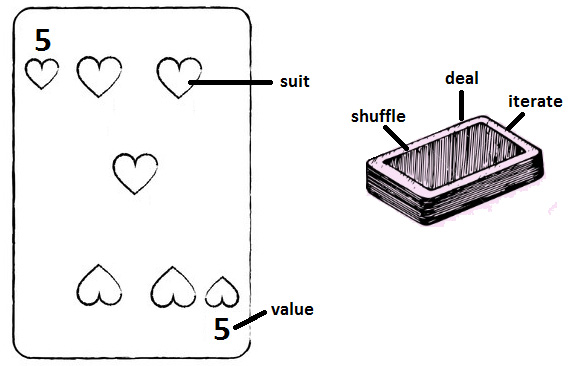
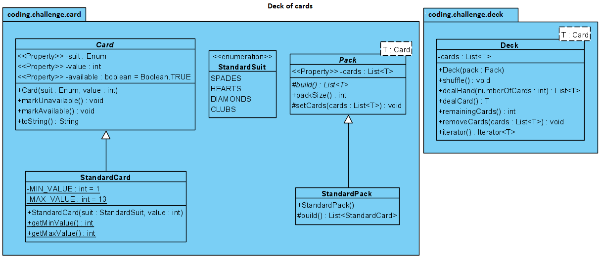

# Jeu de cartes

## Problème

Concevoir les classes principales d'un jeu de cartes générique.

## Questions à poser

Etant donné qu'un carte peut être n'importe quoi, pouvez-vous définir ce qui est *générique* ?

## Intervieweur

Une carte est caractérisée par un symbole et une valeur. Par exemple, pensez à un jeu standard de 52 cartes.

## Solution

On peut visualiser une carte et un jeu de carte comme suit :



### Diagramme UML



### 1. Classes de données (`enum` et `abstract class`)

- Le symbole pour un jeu contient Piques, Coeur, Carreaux ou Trèfles &rarr; idéal pour `enum` Java.
- La valeur d'une carte standard est comprise entre 1 et 13.
- Enum `StandardSuit` : Représente les quatre couleurs standards.
- Classe abstraite `Card` : Contient les champs génériques.
  - `suit` (enum)
  - `value` (int)
  - `available` (boolean)
- Classe `StandardCard` : Etend Card et définit les limites de valeur pour un jeu stand (MIN_VALUE = 1, MAX_VALU = 13).

```java
public enum StandardSuit {
    SPADES, HEARTS, DIAMONDS, CLUBS;
}
```

```java
public abstract class Card {

    private final Enum suit;
    private final int value;

    private boolean available = Boolean.TRUE;

    public Card(Enum suit, int value) {
        this.suit = suit;
        this.value = value;
    }

    // Reste du code
}
```

```java
public class StandardCard extends Card {

    private static final int MIN_VALUE = 1;
    private static final int MAX_VALUE = 13;

    public StandardCard(StandardSuit suit, int value) {
        super(suit, value);
    }

    // Reste du code
}
```

### 2. Paquet de cartes (`Pack`)

- Un paquet de cartes (`Pack`) est formé de plusieurs carte (dans ce cas, 52 cartes standard).
- Classe abstraite `Pack<T extends Card>` : Gère la liste des cartes (`cards`) et définit une méthode abstraite `build()` pour créer le paquet.

```java
public abstract class Pack<T extends Card> {

    private List<T> cards;

    protected abstract List<T> build();

    public int packSize() {
        return cards.size();
    }

    public List<T> getCards() {
        return new ArrayList<>(cards);
    }

    protected void setCards(List<T> cards) {
        this.cards = cards;
    }
}
```

```java
public final class StandardPack extends Pack {

    public StandardPack() {
        super.setCards(this.build());
    }

    @Override
    protected List<StandardCard> build() {
        
        List<StandardCard> cards = new ArrayList<>();

        // logique du code

        return cards;
    }
}
```

### 3. Jeu de cartes (`Deck`)

- Le `Deck` est une classe qui doit être capable d'effectuer des actions avec `Pack`.
- Classe `Deck<T extends Card>` : Gère le paquet et implémente `Iterable<T>`.

```java
public class Deck<T extends Card> implements Iterable<T> {

    private final List<T> cards;

    public Deck(Pack pack) {
        this.cards = pack.getCards();
    }

    public void shuffle() {...}
    public List<T> dealHand(int numberOfCards) {...}
    public T dealCard() {...}
    public int remainingCards() {...}
    public void removeCards(List<T> cards) {...}

    @Override
    public Iterator<T> iterator() {...}
}
```

### 4. Petit démo

```java
// créer une carte classique
Card sevenHeart = new StandardCard(StandardSuit.HEARTS, 7);

// créer un jeu de cartes classique
Pack cp = new StandardPack();
Deck deck = new Deck(cp);

System.out.println("Remaining cards : " + deck.remainingCards());
```
