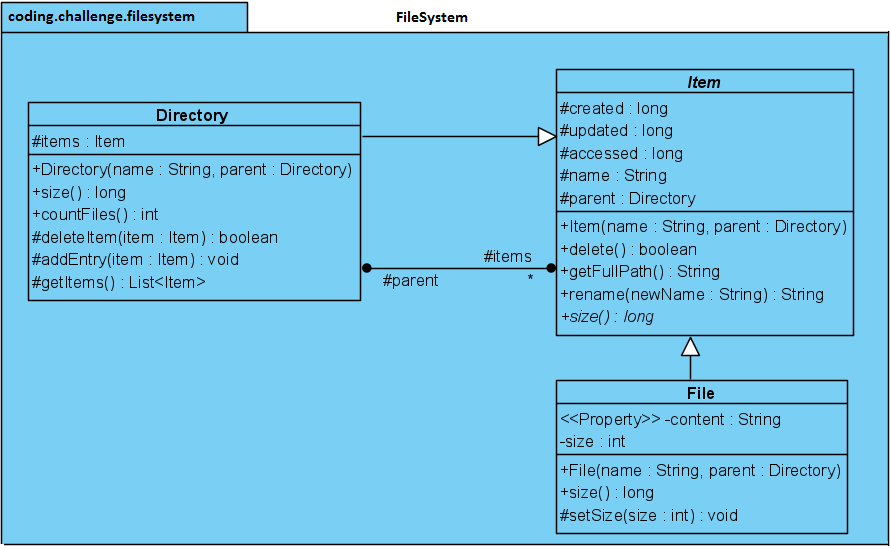

# Système de fichiers

## Problème

Concevoir les classes principales d'un système de fichiers.

## Questions à poser

- Quelles sont les fonctionnalités requises ?
- Quelles sont les composants du système ?

## Interviewer

La conception doit prendre en charge l'ajout, la suppression et le renommage des répertoires et des fichiers.
Il s'agit d'une structure hiérarchique de répertoires et de fichiers, comme dans la plupart des systèmes d'exploitation.

