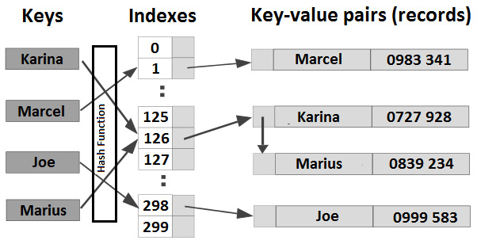

# Hash table

## Problème

Concevoir une table de hachage.

## Questions à poser

- Quelles sont les fonctionnalités requises ?
- Quelle technique pour résoudre "index collisions" ?
- Quel est le type de donnée pour la paire clé-valeur ?

## Interviewer

- Pour les fonctionnalités, rien de spécial. Je veux seulement les méthodes typiques `add()` et `get()`.
- Pour "index collisions", je suggère qu'on utilise le technique de "chaining".
- La paire clé-valeur doit être générique.

## Rappel sur le hash table

Une table de hachage est un type de données qui stocke des paires clé-valeur. Généralement, un tableau contient toutes
les entrées clé-valeur de la table et la taille de ce tableau est définie pour accueillir la quantité de données prévues.
La clé de chaque paire clé-valeur est passée à travers une fonction de hachage (ou plusieurs) qui produit une valeur de
hachage, ou un hash. Principalement, la valeur de hachage représente l'indice de la paire clé-valeur dans table de
hachage (par exemple, si on utilise un tableau pour stocker toutes les paires clé-valeur, alors la fonction de hachage
renvoie l'indice de ce tableau qui doit contenir la paire clé-valeur actuelle). Passer la même clé à travers la fonction
de hachage doit produire le même indice à chaque fois - cela est utile pour retrouver une valeur via sa clé.

Lorsqu'une fonction de hachage génère 2 indices identiques pour des clés différentes, on est confronté à une collision
d'index.
Les techniques les plus utilisées pour résoudre une collision d'index sont le `sondage linéaire` (`linear probing`) (cette
technique cherche linéairement la prochaine case libre dans la table - en essayant de trouver dans le tableau une case,
c'est-à-dire un indice, qui ne contient pas de paire clé-valeur) et le `chaînage` (`chaining`) - (cette technique
modélise une table de hachage sous forme d'un tableau de listes chaînées - les collisions sont stockées au même indice
du tableau sous forme de nœuds de liste chaînée).

Le schéma suivant représente une table de hachage destinée à stocker des paires nom-téléphone.
Elle prend en charge le chaînage (l'entrée Marius-0838234, chaînée à Karina-0727928, car leurs clés, Marius et Karina,
mènent au même indice du tableau, 126).



## Solution

D'abord, il faut définir la structure d'une entrée de table de hachage (`HashEntry`).
Comme dans le schéma précédent, une paire clé-valeur comporte trois parties principales : la clé, la valeur et un lien
vers la prochaine paire clé-valeur (ce qui permet d'implémenter le chaînage).
Etant donné qu'une entrée de table de hachage ne doit être accessible qu'au moyen de méthodes dédiées, telles que `get()`
et `put()`, on l'encapsule comme suit :

```java
public class HashTable<K, V> {

    private static final int SIZE = 10;

    private static class HashEntry<K, V> {

        K key;
        V value;

        HashEntry<K, V> next;

        HashEntry(K k, V v) {
            this.key = k;
            this.value = v;
            this.next = null;
        }
    }
```

Ensuite, on définit le tableau qui contient les `HashEntry`.
Pour les besoins des tests, une taille de 10 éléments suffit et nous permet de tester facilement le chaînage
(une petite taille favorise les collisions).
En pratique, un tel tableau est bien plus grand.

```java
    private final HashEntry[] entries = new HashEntry[SIZE];
```

Ensuite, on ajoute les méthodes `get()` et `put()` :

```java
    public void put(K key, V value) {

        int hash = getHash(key);
    
        final HashEntry hashEntry = new HashEntry(key, value);
    
        if (entries[hash] == null) {
            entries[hash] = hashEntry;
        } else { // collision => chaining
            HashEntry currentEntry = entries[hash];
            while (currentEntry.next != null) {
                currentEntry = currentEntry.next;
            }
    
            currentEntry.next = hashEntry;
        }
    }
        
    public V get(K key) {
        int hash = getHash;

        if (entries[hash] != null) {
            HashEntry currentEntry = entries[hash];
            
            // Parcourir les linked lists d'entry pour trouver la clé 'key'
            while (currentEntry != null) {
                
                if (currentEntry.key.equals(key)) {
                    return (V) currentEntry.value;
                }
                
                currentEntry = currentEntry.next;
            }
        }

        return null;
    }    
```

Finalement, on ajoute une fonction de hachage dummy :

```java
    private int getHash(K key) {
        return Math.abs(key.hashCode() % SIZE);
    }
```

Pour tester le code, on peut le procéder comme suit :

```java
public class Main {

    public static void main(String[] args) {

        HashTable hashTable = new HashTable();

        // Put some key-value
        hashTable.put("ana", "ana".toUpperCase());
        hashTable.put("carina", "carina".toUpperCase());
        hashTable.put("barbu", "barbu".toUpperCase());
        hashTable.put("leo", "leo".toUpperCase());
        hashTable.put("marius", "marius".toUpperCase());
        hashTable.put(5, "FIVE");
        hashTable.put(10, "TEN");

        // The following keys should exists
        System.out.println("Get(ana): " + hashTable.get("ana"));        
        System.out.println("Get(carina): " + hashTable.get("carina"));
        System.out.println("Get(barbu): " + hashTable.get("barbu"));
        System.out.println("Get(leo): " + hashTable.get("leo"));
        System.out.println("Get(marius): " + hashTable.get("marius"));
        System.out.println("Get(5): " + hashTable.get(5));
        System.out.println("Get(10): " + hashTable.get(10));
        
        // The following two keys should not exists
        System.out.println("Get(anna): " + hashTable.get("anna"));
        System.out.println("Get(15): " + hashTable.get(15));               
    }
}
```


