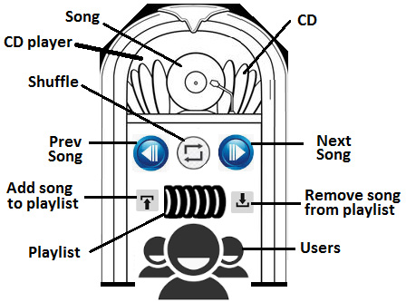
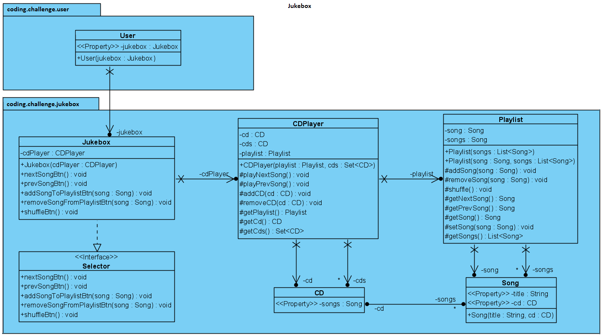

# Concevoir les classes principales de la machine musicale jukebox

## Questions à poser

- Que joue le jukebox - des CD, des MP3 ?
- Que dois-je concevoir - le processus de construction du jukebox, son fonctionnement, ou autre chose ?
- C'est un jukebox gratuit ou faut-il de l'argent ?

## Intervieweur

- Jukebox gratuit.
- Ne joue que des CD.
- Faut concevoir ses fonctionnalités principales + son fonctionnement.

## Solution

Afin de comprendre quelles classes doivent être impliquées dans notre conception, nous essayons de visualiser un jukebox et d'identifier ses parties et fonctionnalités principales.

Esquisser un diagramme aide l'intervieweur à voir comment on pense.

Adopter l'approche de visualisation du problème sous forme écrite.



### Diagramme UML



2 parties principales d'un jukebox : un lecteur de CD + une interface avec des commandes pour les utilisateurs. Le lecteur de CD gère une liste de lecture (`playlist`) et lit ces chansons.

```java
public interface Selector {

    public void nextSontBtn();
    public void prevSongBtn();
    public void addSongToPlaylistBtn(Song song);
    public void removeSongFromPlaylist(Song song);
    public void shuffleBtn();
}
```

```java
public class Jukebox implements Selector {

    private final CDPlayer cdPlayer;

    public Jukebox(CDPlayer cdPlayer) {
        this.cdPlayer = cdPlayer;
    }

    @Override
    public void nextSongBtn() {...}

    // And the rest of implemented methods
}
```

Le `CDPlayer` est le coeur du jukebox. Via `Selector`, on contrôle le comportement de `CDPlayer`.

`CDPlayer` doit avoir accès à l'ensemble des CD disponibles et à la liste de lecture :

```java
public class CDPlayer {

    private CD cd;

    private final Set<CD> cds;
    private final Playlist playlist;

    public CDPlayer(Playlist playlist, Set<CD> cds) {
        this.playlist = playlist;
        this.cds = cds;
    }

    protected void playNextSong() {...}

    protected void playPrevSong() {...}

    protected void addCD(CD cd) {...}

    protected void removeCD(CD cd) {...}

    // getters
}
```

Ensuite, `Playlist` gère une liste de `Song` :

```java
public class Playlist {

    private Song song;

    private final List<Song> songs; // ou Queue

    public Playlist(List<Song> songs) {
        this.songs = songs;
    }

    protected void addSong(Song song) {...}

    protected void removeSong(Song song) {...}

    protected void shuffle() {...}

    protected Song getNextSong() {...}

    protected Song getPrevSong() {...}

    // getters + setters
}
```

```java
public class Song {
    
    private final String title;
    private final CD cd;

    public Song(String title, CD cd) {
        this.title = title;
        this.cd = cd;
    }

    // getters
}
```

```java
public class CD {
    
    private List<Song> songs;

    // getter + setter
}
```

```java
public class User {

    private final Jukebox jukebox;

    public User(Jukebox jukebox) {
        this.jukebox = jukebox;
    }

    public Jukebox getJukebox() {
        return this.jukebox;
    }
}
```
