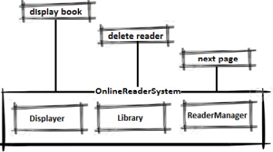
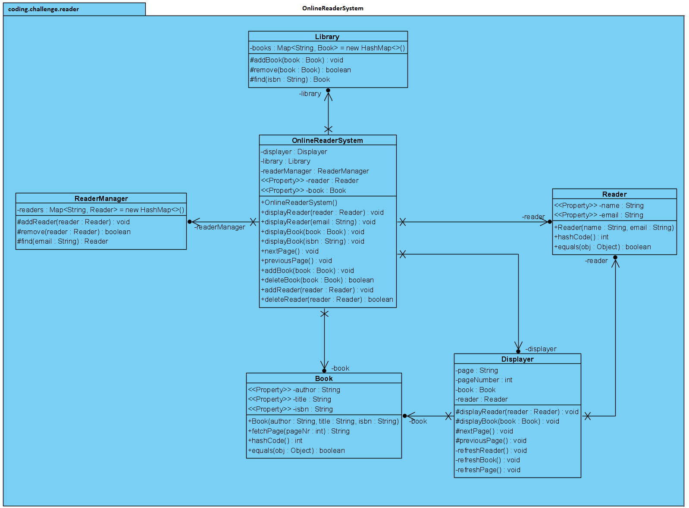

# Système de lecture en ligne

## Problème

Concevoir les classes principales d'un système de lecture en ligne.

## Questions à poser

- Quelles sont les fonctionnalités requises ?
- Combien de livres peuvent être lus simultanément ?

## Intervieweur

- Le système doit pouvoir gérer des lecteurs et des livres.
- Votre code doit permettre d'ajouter/supprimer un lecteur/livre et d'afficher un lecteur/livre.
- Le système peut servir un seul lecteur et un seul livre à la fois.

## Solution

On peut visualiser le sytème comme suit :



### Diagramme UML



Pour gérer les lecteurs et les livres, nous avons besoin de tels objets. Cette partie est petite et facile, commencer
par cela dans une interview aide à décomposer le problème confortablement.

> [!NOTE]
> 
> Lorsqu'on conçoit des objets en interview, il n'est pas nécessaire de faire une version complète d'un objet. 
> 
> Par exemple, un lecteur avec un nom et un email, et un livre avec un auteur, un titre et un ISBN suffisent.

```java
import java.util.Objects;

public class Reader {

    private String name;
    private String email;

    // Constructeur

    // Getters
    
    @Override
    public int hashCode() {
        int hash = 7;
        hash = 71 * hash + Objects.hashCode(this.name);
        hash = 71 * hash + Objects.hashCode(this.email);
        return hash;
    }

    @Override
    public boolean equals(final Object obj) {
        if (this == obj) return true;
        
        if (obj == null) return false;
        
        if (getClass() != obj.getClass()) return false;

        final Reader other = (Reader) obj;
        if (!Objects.equals(this.name, other.name)) return false;
        
        if (!Objects.equals(this.email, other.email)) return false;

        return true;
    }
}
```

```java
import java.util.Objects;

public class Book {

    private final String author;
    private final String title;
    private final String isbn;

    // Constructeur

    // Getters

    public String fetchPage(int pageNr) {
        return "Some page content...";
    }

    @Override
    public int hashCode() {
        int hash = 7;
        hash = 47 * hash + Objects.hashCode(this.isbn);
        return hash;
    }

    @Override
    public boolean equals(final Object obj) {
        if (this == obj) {
            return true;
        }

        if (obj == null) {
            return false;
        }

        if (getClass() != obj.getClass()) {
            return false;
        }

        final Book other = (Book) obj;
        if (!Objects.equals(this.isbn, other.isbn)) {
            return false;
        }

        return true;
    }
}
```

Ensuite, si on considère que les livres sont habituellement gérés par une bibliothèque, on peut regrouper plusieurs
fonctionnalités, telles que l'ajout, la recherche, et la suppression d'un livre, dans une classe `Library` comme suit :

```java
import java.util.HashMap;
import java.util.Map;

public class Library {

    private final Map<String, Book> books = new HashMap<>();

    protected void addBook(Book book) {
        books.putIfAbsent(book.getIsbn(), book);
    }

    protected boolean remove(Book book) {
        return books.remove(book.getIsbn(),
                book);
    }

    protected Book find(String isbn) {
        return books.get(isbn);
    }
}
```

Les lecteurs peuvent être gérées par une classe similaire nommée `ReaderManager`.
Pour lire un livre, il faut un affichage.
La classe `Displayer` devrait afficher les détails du lecteur et du livre, et permettre la navigation dans les pages du livre :

```java
public class Displayer {

    private Book book;
    private Reader reader;
    private String page;
    private int pageNumber;
    
    protected void displayReader(Reader reader) {
        this.reader = reader;
        refreshReader();
    }

    protected void displayBook(Book book) {
        this.book = book;
        refreshBook();
    }

    protected void nextPage() {
        page = book.fetchPage(++pageNumber);
        refreshPage();
    }
    
    protected void previousPage() {
        page = book.fetchPage(--pageNumber);
        refreshPage();
    }
    
    private void refreshReader() {}

    private void refreshBook() {
        pageNumber = 0;
    }
    
    private void refreshPage() {}
}
```

Enfin, il suffit d'encapsuler `Library`, `ReaderManager`, et `Displayer` dans la classe `OnlineReaderSystem`.

```java
public class OnlineReaderSystem {

    private final Displayer displayer;
    private final Library library;
    private final ReaderManager readerManager;
    
    private Reader reader;
    private Book book;

    public OnlineReaderSystem() {
        displayer = new Displayer();
        library = new Library();
        readerManager = new ReaderManager();
    }

    public void displayReader(Reader reader) {
        this.reader = reader;
        displayer.displayReader(reader);
    }
    
    public void displayReader(String email) {
        this.reader = readerManager.find(email);
        if (this.reader != null) {
            displayer.displayReader(reader);
        }
    }
    
    public void displayBook(Book book) {
        this.book = book;
        displayer.displayBook(book);
    }

    public void displayBook(String isbn) {
        this.book = library.find(isbn);
        if (this.book != null) {
            displayer.displayBook(book);
        }
    }

    public void nextPage() {
        displayer.nextPage();
    }

    public void previousPage() {
        displayer.previousPage();
    }

    public void addBook(Book book) {
        library.addBook(book);
    }

    public boolean deleteBook(Book book) {
        if (!book.equals(this.book)) {
            return library.remove(book);
        }

        return false;
    }

    public void addReader(Reader reader) {
        readerManager.addReader(reader);
    }

    public boolean deleteReader(Reader reader) {
        if (!reader.equals(this.reader)) {
            return readerManager.remove(reader);
        }

        return false;
    }

    public Reader getReader() {
        return reader;
    }

    public Book getBook() {
        return book;
    }
}
```

On peut tester notre application comme suit :

```java
public class Main {

    public static void main(String[] args) {

        Reader r = new Reader("Mark Janel", "markjanel@gmail.com");
        Book b = new Book("Olivia Goy", "Carrie", "ISBN:001-OG");

        OnlineReaderSystem ors = new OnlineReaderSystem();

        ors.addReader(r);
        ors.addBook(b);

        ors.displayReader(r.getEmail());
        ors.displayBook(b);

        ors.nextPage();
        ors.nextPage();
        ors.nextPage();
        ors.previousPage();
    }

}
```
