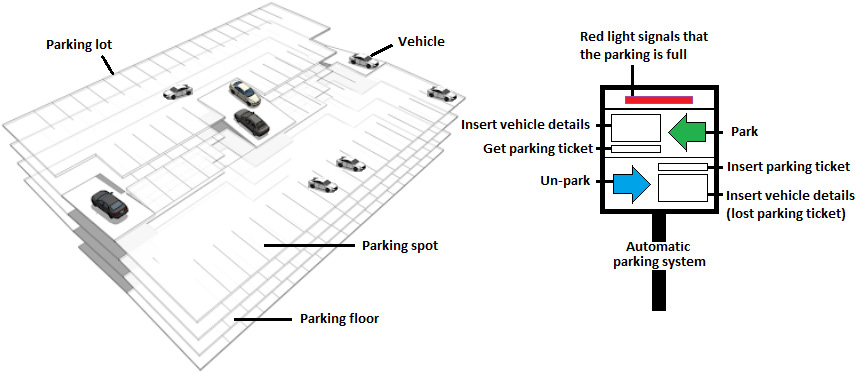
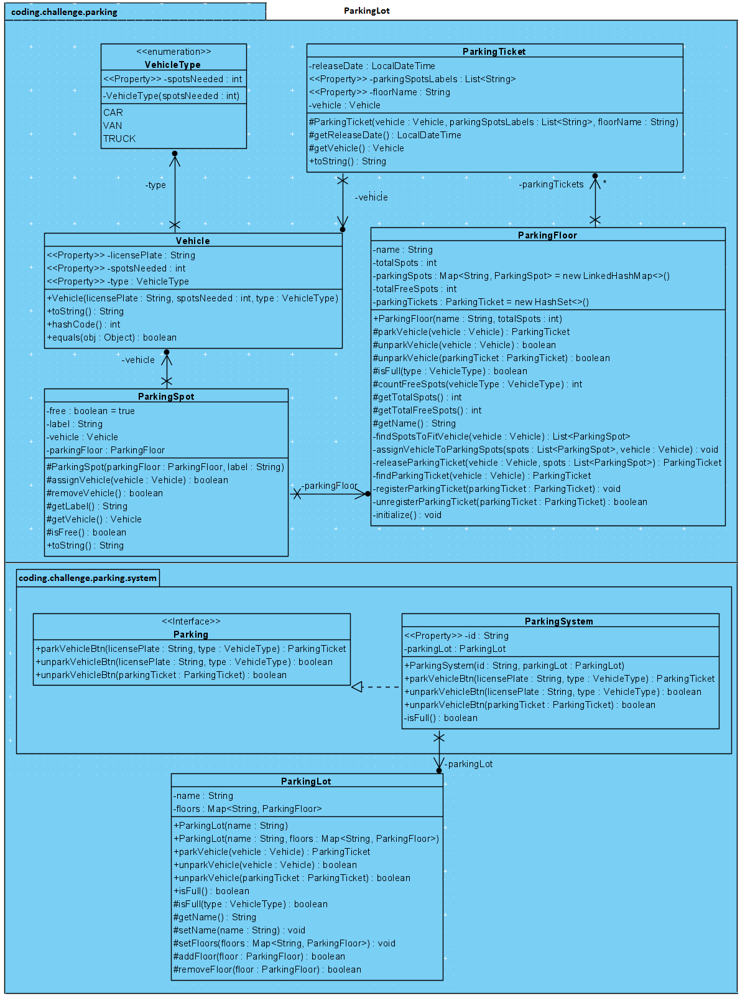

# Parking lot

## Problème

Concevoir les classes principales d'un parking.

## Questions à poser

- Parking à seul niveau ou à plusieurs niveaux ?
- Toutes les places de parking sont identiques ?
- Quels types de véhicules devrait-on garer ?
- Parking gratuit ?
- Utilise-t-on des tickets de parking ?

## Intervieweur

- Parking automatique synchrone à plusieurs niveaux.
- Gratuit.
- Toutes les places de parking ont la même taille.
- On accepte des voitures (1 place), camionnettes (2 places) et camions (5 places). D'autres types de véhicules pourraient être ajoutés sans modifier le code.
- Le système délivre un ticket de parking qui peut être utilisé plus tard pour déparquer le véhicule.
- En supposant que le ticket est perdu, le conducteur peut introduire les informations du véhicule. Le système devrait donc toujours fonctionner, localiser le véhicule dans le parking et le déparquer.

## Solution

### Visualisation d'un parking



Le diagramme donne 2 acteurs majeurs : le parking et le système automatique de parking.

### Diagramme UML



### 1. Conception de `Vehicle` et `VehicleType`

Le système n'a pas besoin d'objets dédiées pour les voiture, camionnettes et camions, mais seulement de leur plaque d'immatriculation et du nombre de places nécessaires.

```java
public enum VehicleType {
    CAR(1), VAN(2), TRUCK(5);

    private final int spotsNeeded;

    private VehicleType(int spotsNeeded) {
        this.spotsNeeded = spotsNeeded;
    }

    // getter
}
```

```java
public class Vehicle {

    private final String licensePlate;
    private final int spotsNeeded;
    private final VehicleType type;

    public Vehicle(String licensePlate, int spotsNeeded, VehicleType type) {
        this.licensePlate = licensePlate;
        this.spotsNeeded = spotsNeeded;
        this.type = type;
    }

    // getters

    @Override
    public String toString() {
        return "Vehicle{" + "licensePlate=" + licensePlate + ", spotsNeeded=" + spotsNeeded + ", type=" + type + '}';
    }

    @Override
    public int hashCode() {
        int hash = 7;
        hash = 89 * hash + Objects.hashCode(this.licensePlate);
        hash = 89 * hash + this.spotsNeeded;
        hash = 89 * hash + Objects.hash(this.type);
        return hash;
    }

    @Override
    public boolean equals(Object obj) {

        if (this == obj) { return true; }

        if (obj == null) { return false; }

        if (getClass() != obj.getClass()) { return false; }

        final Vehicle other = (Vehicle) obj;
        if (this.spotsNeeded != other.spotsNeeded) { return false; }

        if (!Objects.equals(this.licensePlate, other.licensePlate)) { return false; }

        if (this.type != other.type) { return false; }

        return true;
    }
}
```

### 2. Conception du parking `ParkingLot`

`ParkingLot` se compose de plusieurs étages et expose des méthodes pour le stationnement et le déstationnement. Il délègue les tâches de stationnement / déstationnement à l'étage approprié.

```java
public class ParkingLot {

    private String name;
    private Map<String, ParkingFloor> floors;

    public ParkingLot(String name) {
        this.name = name;
    }

    public ParkingLot(String name, Map<String, ParkingFloor> floors) {
        this.name = name;
        this.floors = floors;
    }

    // déléguer à ParkingFloor
    public ParkingTicket parkVehicle(Vehicle vehicle) {
        for (ParkingFloor pf : floors.values()) {
            if (!pf.isFull(vehicle.getType())) {
                ParkingTicket parkingTicket = pf.parkVehicle(vehicle);

                if (parkingTicket != null) {
                    return parkingTicket;
                }
            }
        }

        return null;
    }

    // On trouve le véhicule en parcourant les étages
    public boolean unparkVehicle(Vehicle vehicle) {
        for (ParkingFloor pf : floor.values()) {
            boolean success = pf.unparkVehicle(vehicle);
            if (success) {
                return true;
            }
        }

        return false;
    }

    // On a le ticket, donc on a toutes les informations
    public boolean unparkVehicle(ParkingTicket parkingTicket) {
        return floors.get(parkingTicket.getFloorName()).unparkVehicle(parkingTicket);
    }

    public boolean isFull() {...}

    protected boolean isFull(VehicleType type) {...}

    // getters + setters
}
```

### 3. Conception de `ParkingFloor`

Chaque étage agit comme un parking indépendant, capable de gérer ses propres places et l'enregistrement des tickets.

```java
public class ParkingFloor {

    private final String name;
    private final int totalSpots;
    private final Map<String, ParkingSpot> parkingSpots = new LinkedHashMap<>();
    private final Set<ParkingTicket> parkingTickets = new HashSet<>();
    private int totalFreeSpots;

    public ParkingFloor(String name, int totalSpots) {
        this.name = name;
        this.totalSpots = totalSpots;

        initialize(); // Créer des places de parking
    }

    protected ParkingTicket parkVehicle(Vehicle vehicle) {
        List<ParkingSpot> spots = findSpotsToFitVehicle(vehicle);

        if(spots.isEmpty()) { return null; }

        assignVehicleToParkingSpots(spots, vehicle);

        ParkingTicket parkingTicket = releaseParkingTicket(vehicle, spots);
        registerParkingTicket(parkingTicket);

        return parkingTicket;
    }

    // On trouve le véhicule en parcourant les places de parking
    protected boolean unparkVehicle(Vehicle vehicle) {
        ParkingTicket parkingTicket = findParkingTicket(vehicle);

        if (!parkingTickets.contains(parkingTicket)) {
            return false;
        }

        int countSpots = 0;        
        for(ParkingSpot ps: parkingSpots.values()) {            
            if(ps.getVehicle()!= null && ps.getVehicle().equals(vehicle)) {
                boolean success = ps.removeVehicle();
                if(!success) {
                    return false;
                }
                
                if(++countSpots == vehicle.getSpotsNeeded()) {                    
                    break;
                }
            }
        }

        unregisterParkingTicket(parkingTicket);

        return true;
    }

    // On a le ticket, donc on a toutes les informations
    protected boolean unparkVehicle(Parking parkingTicket) {
        if (!parkingTickets.contains(parkingTicket)) {
            throw new RuntimeException("This ticket is not in our system.");
        }

        List<String> spots = parkingTicket.getParkingSpotsLabels();
        for(String spot : spots) {
            boolean success = parkingSpots.get(spot).removeVehicle();
            if (!success) return false;
        }

        unregisterParkingTicket(parkingTicket);

        return true;
    }

    // On utilise List car camionnette prend 2 places, et camion prend 5 places
    private List<ParkingSpot> findSpotsToFitVehicle(Vehicle vehicle) {
        int count = 0;
        List<ParkingSpot> freeSpots = new ArrayList<>();
        int neededSpots = vehicle.getSpotsNeeded();

        for (int i = 1; i <= totalSpots; i++) {
            if (parkingSpots.get("#" + i).isFree()) {
                count++;
                freeSpots.add(parkingSpots.get("#" + i));
            } else {
                count = 0;
                freeSpots.clear();
            }

            if (count == neededSpots) {
                return freeSpots;
            }
        }

        freeSpots.clear();
        return freeSpots;
    }

    private void assignVehicleToParkingSpots(List<ParkingSpot> spots, Vehicle vehicle) {
        for (ParkingSpot spot : spots) {
            spot.assignVehicle(vehicle);
        }
    }

    private ParkingTicket releaseParkingTicket(Vehicle vehicle, List<ParkingSpot> spots) {
        List<String> spotsLabels = spots.stream().
                .map(ParkingSpot::getLabel)
                .collect(toList());

        return new ParkingTicket(vehicle, spotsLabels, name);
    }

    private ParkingTicket findParkingTicket(Vehicle vehicle) {
        for(ParkingTicket pt : parkingTickets) {
            if(pt.getVehicle().equals(vehicle)) return pt;
        }

        return null;
    }

    private registerParkingTicket(ParkingTicket parkingTicket) {
        this.parkingTickets.add(parkingTicket);
    }

    private unregisterParkingTicket(ParkingTicket parkingTicket) {
        return this.parkingTickets.remove(parkingTicket);
    }

    private void initialize() {
        for (int i = 1; i <= totalSpots; i++) {
            parkingSpots.put("#" + i, new ParkingSpot(this, "#" + i));
        }
    }
}
```

### 4. Conception de `ParkingSpot`

```java
public class ParkingSpot {

    private boolean free = true;
    private Vehicle vehicle;
    private final String label;
    private final ParkingFloor parkingFloor;

    protected ParkingSpot(ParkingFloor parkingFloor, String label) {
        this.parkingFloor = parkingFloor;
        this.label = label;
    }

    protected boolean assignVehicle(Vehicle vehicle) {
        System.out.println("Assign " + label + " at floor "
                + parkingFloor.getName() +  " to " + vehicle);

        this.free = false;
        this.vehicle = vehicle;

        return true;        
    }

    @Override
    public String toString() {
        return "ParkingSpot{" + "label=" + label + '}';
    }   

    // getters
}
```

### 5. Conception de `ParkingSystem`

Le système agit comme un dispatcher et implémente l'interface `Parking` pour les interactions.

```java
public class ParkingSystem implements Parking {

    private final String id;
    private final ParkingLot parkingLot;

    public ParkingSytem(String id, ParkingLot parkingLot) {
        this.id = id;
        this.parkingLot = parkingLot;
    }

    @Override
    public ParkingTicket parkVehicleBtn(String licensePlate, VehicleType type) {
        if (isFull()) {
            // throw error
        }

        Vehicle vehicle = new Vehicle(licensePlate, type.getSpotsNeeded(), type);

        return parkingLot.parkVehicle(vehicle);
    }

    @Override
    public boolean unparkVehicleBtn(String licensePlate, VehicleType type) {
        Vehicle vehicle = new Vehicle(licensePlate, type.getSpotsNeeded(), type);
        return parkingLot.unparkVehicle(vehicle);
    }

    @Override
    public boolean unparkVehicleBtn(ParkingTicket parkingTicket) {
        return parkingLot.unparkVehicle(parkingTicket);
    }

    private boolean isFull() {
        // if true, show a redlight
        
        return parkingLot.isFull();
    }

    // getters
}
```

```java
public class Main {

    public static void main(String[] args) {
        
        Map<String, ParkingFloor> floors = new HashMap<>();                        
        floors.put("Aqua", new ParkingFloor("Aqua", 5));
        floors.put("Magenta", new ParkingFloor("Magenta", 5));
        ParkingLot parkingLot = new ParkingLot("SkyParking", floors);
        
        ParkingSystem parkingSystem = new ParkingSystem("1", parkingLot);
        
        // parking a van
        System.out.println("\n\n");
        ParkingTicket parkingTicket1 = parkingSystem.parkVehicleBtn("003-BOSS", VehicleType.VAN);
        ParkingTicket parkingTicket2 = parkingSystem.parkVehicleBtn("123-333", VehicleType.CAR);
        ParkingTicket parkingTicket3 = parkingSystem.parkVehicleBtn("ANCVV", VehicleType.TRUCK);
        ParkingTicket parkingTicket4 = parkingSystem.parkVehicleBtn("ZZZ-099", VehicleType.CAR);
        
        System.out.println("\n\n");
        System.out.println("Parking ticket: " + parkingTicket1);
        System.out.println("Parking ticket: " + parkingTicket2);
        System.out.println("Parking ticket: " + parkingTicket3);
        System.out.println("Parking ticket: " + parkingTicket4);
        
        // drivers un-park their vehicles via ParkingSystem
        System.out.println("\n\n");
        System.out.println("Un-parking done: " + parkingSystem.unparkVehicleBtn(parkingTicket1));
        System.out.println("Un-parking done: " + parkingSystem.unparkVehicleBtn("123-333", VehicleType.CAR));
        System.out.println("Un-parking done: " + parkingSystem.unparkVehicleBtn("ANCVV", VehicleType.TRUCK));
        System.out.println("Un-parking done: " + parkingSystem.unparkVehicleBtn(parkingTicket4));       
    }
}
```
