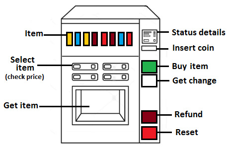
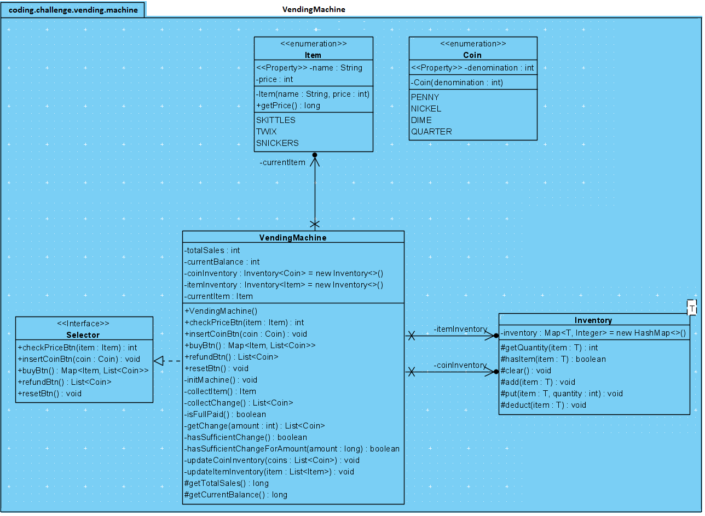

# Concevoir les classes principales pour les fonctionnalités d'un distributeur automatique

## Questions

- C'est un distributeur avec différents types de pièces de monnaie et d'articles ?
- Possède-t-il des fonntionnalités telles que la vérification du prix d'un article, l'achat d'un article, un remboursement et une réinitialisation ?

## Intervieweur

- Oui exactement ! Pour les pièces de monnaie, il prend en compte les pièces de 10 centimes, 20 centimes, 50 centimes, 1 euro et 2 euros.

## Solution

Pour comprendre quelles classes implémenter, on peut visualiser un distributeur automatique comme suit :



### Diagramme UML



### 1. Enums

Les articles et les pièces sont idéals pour les `enums` Java

- `Coin` : Repésente les pièces(10 centimes, 20 centimes, 1 euro, 2 euros).
- `Item` : Représente les articles (ex. LION("Lion", 1.5), TWIX("Twix", 2.2)).

```java
public enum Coin {
    10_CENT(0.10), 20_CENT(0.20), 50_CENT(0.50), 1_EUR(1), 2_EUR(2);
}
```

```java
public enum Item {
    LION("Lion", 1.5), TWIX("Twix", 2.2),
    ... ; 
}
```

### 2. Classe Inventory\<T\>

Le distributeur a besoin d'un inventaire interne pour suivre les articles et l'état des pièces. Cette classe peut être générique et gérer des quantités via une `Map`. Elle expose des méthodes `protected`

```java
public final class Inventory<T> {

    private Map<T, Integer> inventory = new HashMap<>();

    protected int getQuantity(T item) {...}
    protected boolean hasItem(T item) {...}
    protected void clear() {...}
    protected void add(T item) {...}
    protected void put(T item, int quantity) {...}
    protected void deduct(T item) {...}
}
```

### 3. Interface Selector

Les commandes utilisées par un client pour interagir avec le distributeur.

```java
public interface Selector {

    public int checkPriceBtn(Item item);
    public void insertCointBtn(Item item);
    public Map<Item, List<Coin>> buyBtn();

    public List<Coin> refundBtn();
    public void resetBtn();
}
```

### 4. Classe VendingMachine

Classe principale qui implémente l'interface `Selector`.

```java
public class VendingMachine implements Selector {

    private final Inventory<Coin> coinInventory = new Inventory<>();
    private final Inventory<Item> itemInventory = new Inventory<>();
    private int totalSales;
    private int currentBalance;

    private Item currentItem;

    public VendingMachine() {
        initMachine();
    }

    private void initMachine() {
        System.out.println("Initializing the vending machine with coins and items ...");
    }

    // Overriden methods
}
```
