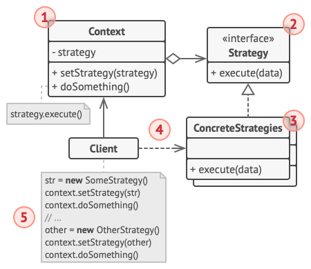

# SOLID + GOF + Design Patterns

## 1. Quel concept POO sert le patron de conception `Decorator` ?
**Composition**. Grâce à cela, le patron de conception Decorator fournit de nouvelles fonctionnalités sans modifier la classe d'origine.

## 2. Quand utiliser Singleton ?
- Quand on a besoion d'**une seule instance** d'une classe au niveau de l'appli.
- Cependant, cela augmente le **couplage entre les classes** &rarr; bottleneck lors du développement, tests et debug.
- Bonne utilisation : 
    - `enum` meilleure façon d'implémenter.
    - Configs globales (loggers, java.lang.Runtime).
    - Accès au matériel (hardware).
    - Connexions aux BDD.

## 3. Diff. Strategy <> State design patterns ?

### Strategy

- Permet de basculer entre diff. algos.
- Les algos sont utilisés de manière ineterchangeable par le client via la composition et la délégation à l'exécution.
- Le client peut choisir l'algo qu'il souhaite, dans n'importe quel ordre. 
    - Par exemple, diff. stratégies pour livrer un colis.

### State

- Le comportement dépend de l'état.
- Affiche des comportements différents dans des états différents sans changer la classe.
- Possède un ordre clair de transition d'état, créant un flux en liant chaque état à un autre.
    - Par exemple, un colis peut passer de l'état *Commandé* &rarr; *Expédié* &rarr; *Livré*.