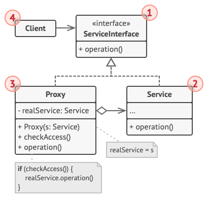

# SOLID + GOF + Design Patterns

## 0. GOF ?

- 23 patrons de conception classiques.
- 3 catégories :
  - **Creational** : Patterns pour la création d'un objet.
  - **Structural** : Patterns pour la structure d'une classe (Héritage, Composition).
  - **Behavioral** : Patterns pour l'interaction entre les objets, favorisant faible couplage et l'extension.

### Creational (5 patterns)

- **Singleton** :
  - Classe possède **une seule instance** et fournit un **point d'accès global** à cette instance.
  - Utile pour ressources partagées et configurations.
- **Factory** :
  - Définit une interface pour créer un objet.
  - Permet aux **subclasses de décider quelle classe instantier**.
  - Centralise la création d'objets tout en permettant une flexibilité pour différents types de produits.
- **Abstract Factory** :
  - Fournit une interface pour la création de **familles d'objets** sans spécifier leurs classes concrètes.
  - "Factory of factories".
- **Builder** :
  - Sépare la **construction d'un objet complexe**.
  - Permet de **créer différents représentations**.
  - Idéal pour les objets avec plusieurs paramètres optionnels.
- **Prototype** :
  - Créer de nouveux objets **en copiant un objet existant** (le prototype) au lieu de créer de nouvelles instances à partir de zéro.
  - Efficace pour la création d'objets complexes.

## 1. Quel concept POO sert le patron de conception `Decorator` ?

**Composition**. Grâce à cela, le patron de conception Decorator fournit de nouvelles fonctionnalités sans modifier la classe d'origine.

## 2. Quand utiliser Singleton ?

- Quand on a besoion d'**une seule instance** d'une classe au niveau de l'appli.
- Cependant, cela augmente le **couplage entre les classes** &rarr; bottleneck lors du développement, tests et debug.
- Bonne utilisation :
  - `enum` meilleure façon d'implémenter.
  - Configs globales (loggers, java.lang.Runtime).
  - Accès au matériel (hardware).
  - Connexions aux BDD.

## 3. Diff. Strategy <> State design patterns ?

### Strategy

- Permet de basculer entre diff. algos.
- Les algos sont utilisés de manière ineterchangeable par le client via la composition et la délégation à l'exécution.
- Le client peut choisir l'algo qu'il souhaite, dans n'importe quel ordre. 
  - Par exemple, diff. stratégies pour livrer un colis.

### State

- Le comportement dépend de l'état.
- Affiche des comportements différents dans des états différents sans changer la classe.
- Possède un ordre clair de transition d'état, créant un flux en liant chaque état à un autre.
  - Par exemple, un colis peut passer de l'état *Commandé* &rarr; *Expédié* &rarr; *Livré*.

## 4. Diff. Proxy <> Decorator ?

### Proxy

- Fournit une passerelle pour contrôler l'accès à un objet.
- Crée des objets "proxy" qui se substituent à l'objet réel.
- Décide comment et quand transférer les requêtes à l'objet réel.
- Le chaînage des proxies n'est pas recommandé.

### Decorator

- Ne crée pas d'objets.
- Décore un objet existant avec de nouvelles fonctionnalités à l'exécution.
- Le chaînage de décorateurs dans un certain ordre est une manière correcte d'exploiter ce patron.

## 5. Diff. Facade <> Decorator ?

### Facade

- N'ajoute pas de nouvelles fonctionnalités.
- Sert de "façade" aux fonctionanlités existantes en masquant la complexité du système.
- Expose une interface qui appelle des composants individuels pour accomplir des tâches complexes.

### Decorator

- Ajoute de nouvelles fonctionnalités à un objet existant (décorer l'objet).

## 6. Diff. Template Method <> Strategy ?

**Les 2 encapsulent des algos (spécifiques à un domain / domain-specific) dans des objets, mais ils ne le font pas de la même manière.**

### Strategy

- Permet de décider entre diff. algos (stratégies) à l'exécution, selon les besoins.

*Par exemple, le pattern Strategy choisit parmis différentes méthodes de paiement (carte de crédit, PayPal)*.

### Template Method

- Définit un squelette fixe pour l'implémentation d'un algo.
- Suit une séquence d'étapes prédéfinie.
- Certains étapes fixes, d'autres peuvent être flexibles.

*Par exemple, le pattern Template Method décrit une liste d'étapes à faire pour une stratégie (le paiement par PayPal doit passer un nombre d'étapes).*

## 7. Diff. Builder <> Factory ?

### Builder

- Conçu pour construire des objets complexes.
- Utilise le chaînage de méthodes `set`.
- Permet de former n'importe quelle combinaison de paramètres.
- Méthode `build()` à la fin de la chaîne.
- Agit comme un wrapper de tous les paramètres possibles d'un constructeur.
- Permet d'éviter le "telescopic constructor".

### Factory

- Crée un objet en un seul appel de méthode.
- Nécessite de passer tous les paramètres nécessaires lors de cet appel.
- Agit comme un wrapper d'un constructeur.
- Idéal pour les objets avec un nombre fixe de paramètres.

## 8. Diff. Adapter <> Bridge ?

### Adapter (After)

- **Objectif** : Fournir une compatibilité entre un code existant non-modifiable (librairie externe), et un nouveau système/interface.
- **Relation dans le temps** : L'adaptateur est implémenté **après** que les composants aient été conçus 
- Agit comme un **intermédiaire** entre 2 systèmes indépendants mais ne peuvent pas communiquer entre eux.

### Bridge (Before)

- **Objectif** : Découpler une abstraction de son implémentation.
- **Relation dans le temps** : Le pont est mis en oeuvre **en amont** ou **dès le départ**.
- Permet la variation de l'abstraction de l'implémentation, évitant le nombre de classes cumulé et pb de scalabilité.