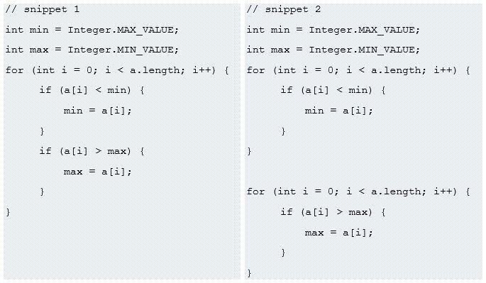
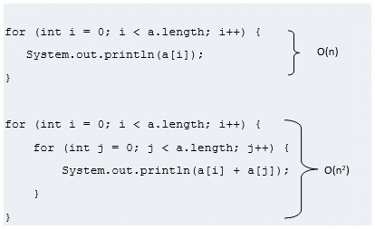
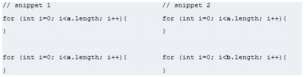
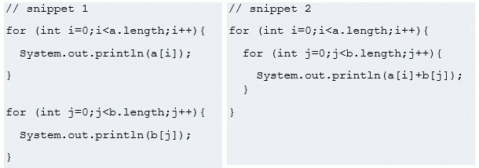
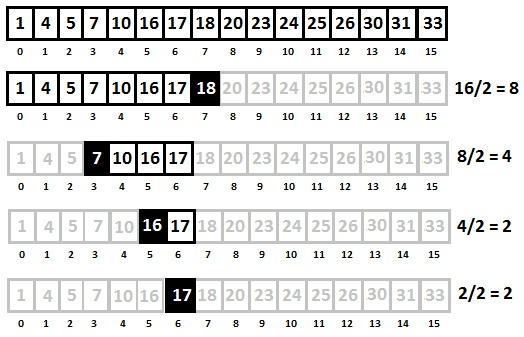
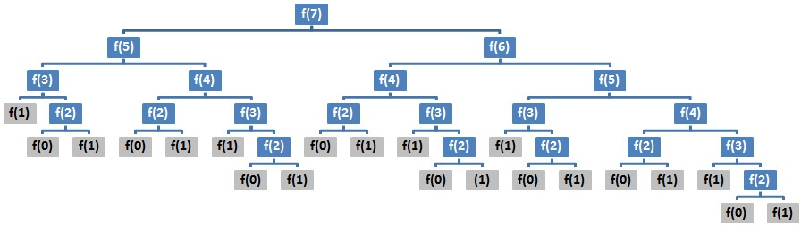
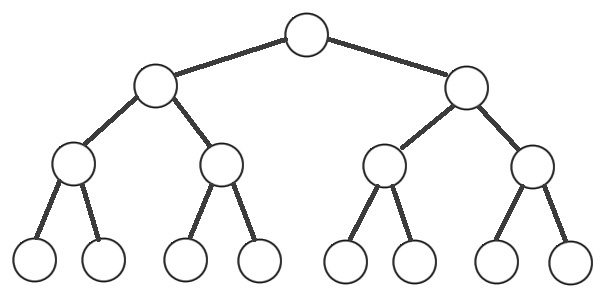
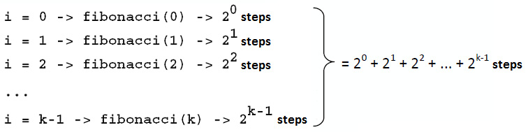
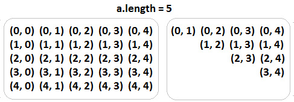

# Exemple 1 - O(1)

```java
return 23;
```
&rarr; O(1)

```java
// cars est un tableau
int thirdCar = cars[3];
```
&rarr; O(1). Quel que soit le nombre d'éléments dans le tableau, obtenir un élément à partir de l'index est une opération constante.

```java
// 'cars' est un java.util.Queue
Car car = cars.peek();
```
- La méthode `Queue#peek()` récupère, mais ne supprime pas, la tête (1er élément) de cette file d'attente. 
- Nombre d'éléments qui suivent la tête n'a pas d'importance.
- Le temps de la méthode `peek()` est de O(1).

# Exemple 2 - O(n) - algo en temps linéaire
```java
// 'a' est un tableau
for (int i = 0; i < a.length; i++>) {
    System.out.println(a[i]);
}
```
- Combien de fois la boucle itère? &rarr; a.length fois.
- Le temps augmente de manière linéaire avec la taille du tableau.
- Temps de O(a.length) = O(n)

# Exemple 3 - O(n) - abandon des constants (dropping the constants)
```java
// 'a' est un tableau
for (int i = 0; i < a.length; i ++) {
    System.out.println("Current element:");

    System.out.println(a[i]);

    System.out.println("Current element + 1:");

    System.out.println(a[i] + 1);
}
```
&rarr; O(n)



&rarr; Le cas 2 a un temps de O(2n) = O(n)

# Exemple 4 - abandon des termes non dominants


- La première boucle est exécutée en O(n).
- La deuxième boucle est en O($n^2$).

&rarr; O(n) + O($n^2$) = O(n + $n^2$) ?

**Non!** 

- Le taux de croissance vient de $n^2$, tandis que n est terme **non dominant**.
- Si la taille du tableau augmente, alors $n^2$ affecte le taux de croissance bien plus que n &rarr; n n'est pas pertinent.

> Quelques exemples supplémentaires
- O($2^n + 2^n$) &rarr; abandonner les constantes et les termes non dominants &rarr; O($2^n$).
- O(n + log n) &rarr; abandonner les termes non dominants &rarr; O(n).
- O($3n^2 + n + 2n$) &rarr; abandonner les constantes et les termes non dominants &rarr; O($n^2$).

> [!NOTE] 
> Abandonner les termes non dominants.

# Exemple 5 - entrées différenes &rarr; variables différentes

*a et b sont des tableaux*


- **Snippet 1 :** 2 boucles parcourant le même tableau &rarr; O(n).
- **Snippet 2 :** 
    - 2 boucles
    - Mais 2 tableaux différents
    - **Big O != O(n)**
    - &rarr; Big O = O(a + b)

> [!NOTE]    
> Des entrées différentes &rarr; des variables différentes.

# Exemple 6 - Les différentes étapes sont additionnées ou multipliées
*a et b sont des tableaux*


- **Snippet 1 :** O(a + b)
- **Snippet 2 :** O(a * b)

# Exemple 7 - Temps d'exécution en log n
*Considérons les étapes de l'algo Binary Search: D'abord, nous comparons `x` avec le point central du tableau, `p`. Si `x > p`, nous cherchons la partie droite du tableau, et vice versa.*



- On commence avec 16 éléments et finit avec 1 élément.
- Après la 1ère étape, on n'a que 16 / 2 = 8 éléments.
- Après la 2ème étape, on n'a que 8 / 2 = 4 éléments.
- Après la 3ème étape, on n'a que 4 / 2 = 2 éléments.
- A la dernière étape, on trouve l'élément recherché, 17.

On peut traduire cet algo en pseudo-code:

    search 17 in {1, 4, 5, 7, 10, 16, 17, 18, 20, 23, 24, 25, 26, 30, 31, 33}

        compare 17 to 18 -> 17 < 18

        search 17 in {1, 4, 5, 7, 10, 16, 17, 18}

            compare 17 to 7 -> 17 > 7

            search 17 in {7, 10, 16, 17}

                compare 17 to 16 -> 17 > 16

                search 17 in {16, 17}

                    compare 17 to 17

                    return    

&rarr; L'algo consiste en une division continue par 2 jusqu'à ce qu'il reste qu'un seul élément.

&rarr; Temps d'exécution total dépend du nombre d'étapes nécessaires pour trouver un élément dans le tableau.

Dans l'exemple, on a 4 étapes (en divisant le tableau 4 fois). On peut l'exprimer comme suit :

$16 * \frac{1}{2} = 8; 8 * \frac{1}{2} = 4; 4 * \frac{1}{2} = 2; 2 * \frac{1}{2} = 1$ 

On peut le condenser comme suit :

$16 * (\frac{1}{2})^4 = 1$

On peut l'exprimer pour le cas général (où n est la taille du tableau, k est le nombre d'étapes pour atteindre la solution) :

$n * (\frac{1}{2})^k = 1$

=> $n * \frac{1}{2^k} = 1$

=> $2^k * \frac{n}{2^k} = 2^k$

=> $2^k = n$

$2^k = n$ est exactement ce que signifie le logarithme. On peut donc écrire :

$2^k = n$ &rarr; $log_2 n = k$

Dans notre cas, $2^k = n$ signifie $2^4 = 16$ donc $log_2 16 = 4$

> Le Big O pour l'algo Binary Search est O(log n). <br>
> Où est la base du log? &rarr; Pas nécessaire pour exprimer le Big O, car les logarithmes de bases différentes ne diffèrent que par un facteur constant. 

>[!NOTE]
> Lorsqu'on doit exprimer le Big O pour un algo qui divise son entrée par `2` à chaque étape/itération, il y a de grandes changes qu'il s'agisse d'un cas de O(log n).

# Exemple 8 - Temps d'exécution récursifs

```java
int fibonacci(int k) {
    if (k <= 1) {
        return k;
    }

    return fibonacci(k - 2) + fibonacci(k - 1);
}
```



- Le profondeur de l'abre est `k = 7`.
- Chaque niveau a 2 fois plus d'appels que le précédent.
- La complexité temporelle est de $O(branches^{profondeur})$ <br> 
&rarr; $O(2^k)$ , noté $O(2^n)$.
- La complexité spatiale est de $O(n)$ , car à aucun moment il n'y a plus de `k` nombres dans la pile d'appels. L'exemple montre qu'on ne peut avoir que les nombres entre 1 et 7.

# Exemple 9 - Parcours "in-order" d'un arbre binaire

```java
void printInOrder(Node node) {
    if (node != null) {
        printInOrder(node.left);
        System.out.println(" " + node.element);
        printInOrder(node.right);
    }
}
```

> Considérons un arbre de recherche binaire parfait - noeuds internes ont **2 enfants** + toutes les feuilles sont au **même niveau** ou à la **même profondeur**.



- Pour 15 noeuds, nous avons une profondeur de 4 <br>
&rarr; On a $$2^4 = 16 \implies log_2(16) = 4$$
- Pour 7 noeuds, nous avons une profondeur de 3 <br>
&rarr; On a $$2^3 = 8 \implies log_2(8) = 3$$
- Pour 31 noeuds, nous avons une profondeur de 5 <br>
&rarr; On a $$2^5 = 32 \implies log_2(32) = 5$$

On peut donc exprimer Big O comme $O(2^{log(n)})$, puisque la profondeur est approx. $log(n)$.

---

$2^{log(n)} = X$ <br/> 

$\implies log_2(X) = log(n)$ <br/>

$\implies X = n$ <br/>

$\implies O(X) = O(n)$ <br/>

Donc, Big O dans ce cas est $O(n)$

> [!NOTE]
> On peut remarquer qu'un parcours "in-order" visite chaque noeud de l'arbre exactement une fois. Comme le travail à chaque noed est constant, la complexité totale est proportionnelle au nombre de noeuds &rarr; $O(n)$

# Exemple 10 - n peut varier
```java
void printFibonacci(int k) {
    for (int i = 0; i < k; i++) {
        System.out.println(i + " : " + fibonacci(i));
    }
}

int fibonacci(int k) {
    if (k <= 1) {
        return k;
    }
    return fibonacci(k - 2) + fibonacci(k - 1);
}
```

- D'après l'exemple 8, on sais que Big O de `fibonacci()` est de $O(2^n)$.
- `printFibonacci()` appelle `fibonacci()` n fois &rarr; $O(n) * O(2^n) = O(n2^n)$ ?
- **Non !** `fibonacci()` n'est pas appelée avec la même valeur `k` à chaque fois, mais avec `i`, qui change à chaque tour de boucle :



&rarr; La complexité de cette somme est dominée par le dernier terme, le plus coûteux, $O(2^k)$, ou $O(2^n)$.

# Exemple 11 - Memoïsation (memoization)

```java
void printFibonacci(int k) {
    int[] cache = new int[k];
    for (int i = 0; i < k; i++) {
        System.out.println(i + ": " + fibonacci(i, cache));
    }
}

int fibonacci(int k, int[] cache) {
    if (k <= 1) {
        return k;
    } else if (cache[k] > 0) {
        return cache[k];
    }

    cache[k] = fibonacci(k - 2, cache) + fibonacci(k - 1, cache);

    return cache[k];
}
```

Cette technique permet de mettre en cache la valeur de calculée et de l'utiliser pour réduire les appels récursifs. Visualisons le temps d'exécution pour `k = 7` :

```
Appel de fibonacci(0): Le résultat de fibonacci(0) est 0

Appel de fibonacci(1): Le résultat de fibonacci(1) est 1

Appel de fibonacci(2): 
    fibonacci(0) 
    fibonacci(1) 
    fibonacci(2) est calculé et mis en cache[2]
Le résultat de fibonacci(2) est 1 --> cache[2] = 1

Appel de fibonacci(3): 
    fibonacci(1) 
    fibonacci(2) est récupéré du cache[2] : 1
    fibonacci(3) est calculé et mis en cache[3]
Le résultat de fibonacci(3) est 2 --> cache[3] = 2

Appel de fibonacci(4): 
    fibonacci(2) est récupéré du cache[2] : 1 
    fibonacci(3) est récupéré du cache[3] : 2
    fibonacci(4) est calculé et mis en cache[4]
Le résultat de fibonacci(4) est 3 --> cache[4] = 3

Appel de fibonacci(5):  
    fibonacci(3) est récupéré du cache[3] : 2  
    fibonacci(4) est récupéré du cache[4] : 3  
    fibonacci(5) est calculé et mis en cache[5]  
Le résultat de fibonacci(5) est 5 --> cache[5] = 5

Appel de fibonacci(6):  
    fibonacci(4) est récupéré du cache[4] : 3  
    fibonacci(5) est récupéré du cache[5] : 5  
    fibonacci(6) est calculé et mis en cache[6]  
Le résultat de fibonacci(6) est 8 --> cache[6] = 8
```

- Chaque méthode `fibonacci(k)` est calculée à partir de `fibonacci(k - 1)` et `fibonacci(k - 2)` mises en cache.
- Récupérer les valeurs calculées et les additionner &rarr; temps constant.

&rarr; $O(n)$

# Exemple 12 - Parcourir la moitié de la matrice

```java
// Extrait 1
for (int i = 0; i < a.length; i++) {
    for (int j = 0; j < a.length; j++) {
        System.out.println(a[i] + a[j]);
    }
}

// Extrait 2
for (int i = 0; i < a.length; i++) {
    for (int j = i + 1; j < a.length; j++) {
        System.out.println(a[i] + a[j]);
    }
}
```

On peut visualiser le temps d'exécution de ces 2 extraits. En supposant que `a.length = 5` :



- La 1ère matrice a un temps d'exécution de 
$$n * n = n^2 \implies O(n^2)$$
- La 2ème matrice a un temps d'exécution de
$$\frac{n*n}{2} = \frac{n^2}{2} = n^2 * \frac{1}{2} \implies O(n^2)$$

Donc les 2 matrices ont une complexité de $O(n^2)$

- Pour la 1ère matrice, la boucle interne s'exécute `n` fois, et encore `n` fois par la boucle externe, ce qui donne $O(n^2)$.
- Pour la 2ème matrice, la boucle interne effectue `n/2` opérations + exécutée `n` fois par la boucle externe, donc $n * \frac{n}{2} = \frac{n^2}{2}$, ce qui donne $O(n^2)$, après la suppression des constantes.

# Exemple 13 - Indentifier les boucles en O(1)
```java
for (int i = 0; i < a.length; i++) {
    for (int j = 0; j < a.length; j++) {
        for (int q = 0; q < 1000000; q++) {
            System.out.println(a[i] + a[j]);
        }
    }
}
```

- La 3ème boucle iètre un nombre fixe $\implies O(1)$ 
- Big O pour cet exemple est $O(n^2)$

# Exemple 14 - Itérer la moitié d'un tableau
```java
for (int i = 0; i < a.length / 2; i++) {
    // do something
}
```
$O(n/2) \implies O(n)$

# Exemple 15 - Réduire les expression Big O
Lequel des 2 peut être réduire à $O(n)$ ?

$$O(n + p)$$
$$O(n + log(n))$$

$\implies O(n + log(n))$, puisque $log(n)$ est le terme non-dominant par rapport à $n$. 

Si on ne connaît pas la relation entre $n$ et $p$, on doit garder les deux.

# Exemple 16 - Boucles avec $O(\log n)$

```java
for (int i = 0; i < a.length; i++) {
    for (int j = a.length; j > 0; j /= 2) {
        System.out.println(a[i] + ", " + j);
    }
}
```

- Boucle externe $O(n)$
- Boucle interne : 
    - Diviser j par 2 $\implies O(\log(n))$
- Complexité totale : 
$O(n) * O(\log(n)) = O(n \log(n))$

> [!NOTE] 
> Algos de tri (Merge Sort, Heap Sort) ont une complexité de $O(n \log(n))$.
>
> Beaucoup d'algos en $O(n \log(n))$ sont récursifs.
>
> En général, les algos de type "Diviser pour régner (Divise and Conquer)" sont en $O(n\;\log\:n)$.