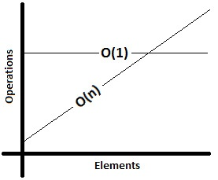
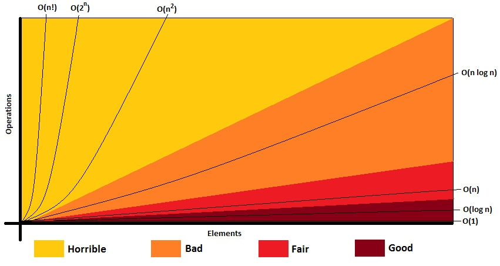

# Analogie
- Temps nécessaire pour commander un film (qui arrive en un jour, peu importe le nombre d'articles) <> Temps de téléchargement (proportionnel à la taille des fichiers)
- Temps d'expédition O(1) <> Temps de téléchargement O(n)
- Commande en ligne est plus évolutive ("scales better") que le téléchargement
- Big O représente une mesure de temps d'exécution **asymtotique**

# Temps de complexité Big O (Big O complexity time)

- A certain point, un algorithme de complexité O(n) (temps linéaire) prend plus de temps qu'un algo de complexité O(1) (temps constant)
- Donc, jusqu'à ce que O(n) surpasse O(1), O(n) a une meilleure performance que O(1)
- Autres temps d'exécution les plus courants: 
    - O(log n), O(n log n) - temps logarithmique
    - O($n^2$) - temps quadratique
    - O($2^n$) - temps exponentiel
    - O(n!) - temps factoriel

*La complexité nécisste parfois plusieurs variables (par exemple, `O(wl)` pour le temps nécessaire pour tondre l'herbe sur un terrain de foot, où `w` est la largeur du terrain et `l` la longueur). Si on doit tondre `p` terrains, le temps est de `O(wlp)`*

*On peut aussi prendre en compte l'espace mémoire. Par exemple, construire un tableau de `n` éléments nécessitte `O(n)` d'espace mémoire; construire une matrice de `n x n` éléments nécessite O($n^2$) d'espace mémoire*

# Le meilleur cas, le pire cas et le cas attendu
- Le meilleur cas: les données d'entrée remplissent des conditions exceptionnelles &rarr; l'algo le plus performant
- Le pire cas: les données d'entrée défavorables &rarr; pires performances de l'algo
- Le cas attendu: Performances typiques